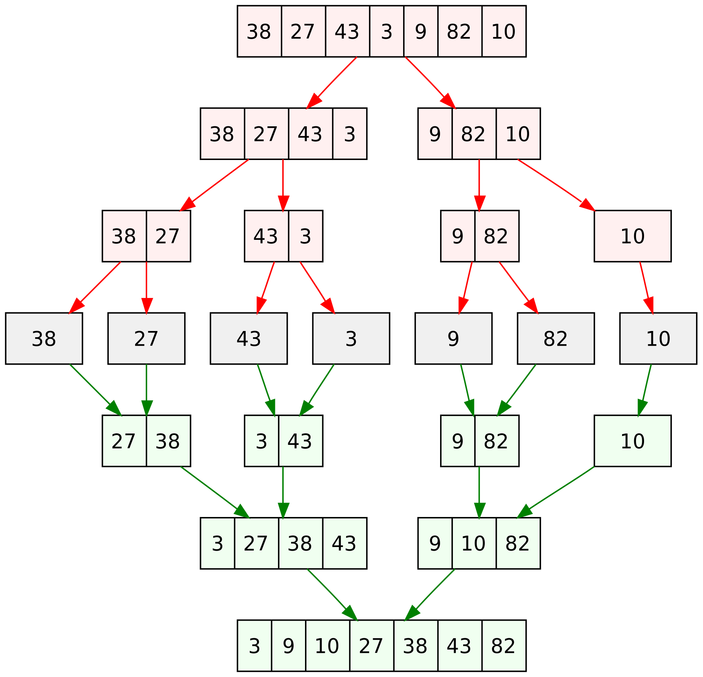
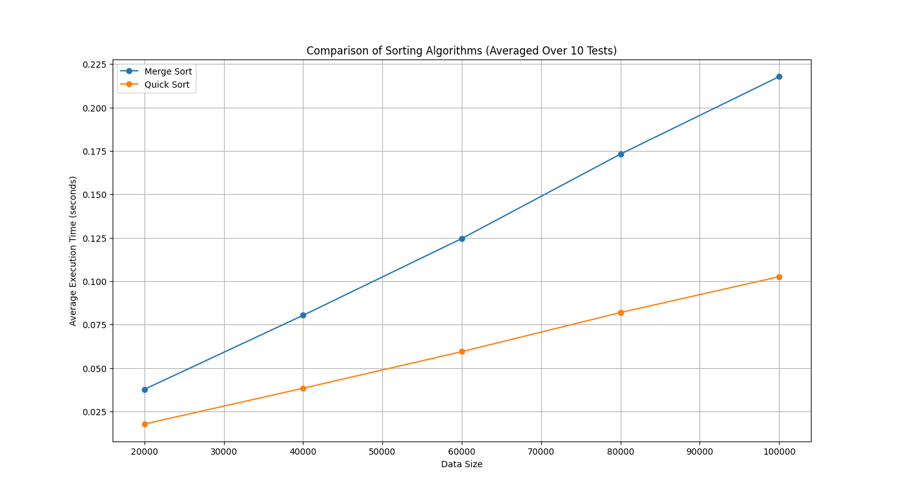

# *Advanced Sorting Algorithms*

In this article, I will present 2 algorithms: Merge Sort and Quick Sort. Which one and how does it work? And why are the working speeds not the same? This article will explain it to you.

### *First (What Merge Sort amd Quick Sort is?)*

#### Merge Sort

Merge Sort is a popular and efficient sorting algorithm that follows the divide-and-conquer paradigm. It works by dividing an unsorted list into smaller sublists, sorting those sublists, and then merging them back together to create a sorted list. Here's a step-by-step explanation of how Merge Sort works:

1. Divide: The unsorted list is divided into two halves, roughly equal in size. This division continues recursively until each sublist contains only one element. This is achieved by repeatedly dividing the list in half.

2. Conquer: After the list is divided into the smallest possible sublists (single elements), we consider each of these single-element sublists as already sorted. Now, we start merging the sublists back together in a sorted manner.

3. Merge: The merge step involves combining two sorted sublists into a single sorted list. This process continues until all sublists are merged and the entire list is sorted. It works as follows:

    - Take the first element from each of the two sublists.

    - Compare the two elements and put the smaller one into a new   list.

    - Move to the next element in the sublist from which you took the smaller element.

    - Repeat the process until you have merged all elements from both sublists into the new list.

4. Repeat: Steps 1, 2, and 3 are repeated recursively until all sublists are merged into one sorted list. 

And this is a picture of Merge Sort working:

    Picture from wikipedia

Merge Sort is known for its stability and efficiency. It has a time complexity of O(n log n), which makes it a good choice for sorting large lists. Additionally, it's a stable sort, meaning it preserves the relative order of equal elements in the sorted list.

#### Quick Sort

Quick Sort works by selecting a "pivot" element from the list and partitioning the other elements into two sublists - those less than the pivot and those greater than the pivot. It then recursively sorts these sublists. Here's a step-by-step explanation of how Quick Sort works:

1. Pivot Selection: Choose a pivot element from the list. The choice of the pivot can affect the performance of the algorithm, and there are various strategies for selecting a pivot. A common approach is to choose the last element in the list, but other strategies like selecting a random element or using a median-of-three method can also be more efficient in some cases.

2. Partitioning: Rearrange the list so that all elements less than the pivot are on the left, and all elements greater than the pivot are on the right. This process is called partitioning. It can be done in several ways

    - By the way to present according to my code is Start with two pointers i and j.

    - Move i to the right until you find an element that is greater than or equal to the pivot.

    - Move j to the right until you find an element that is less than or equal to the pivot.

    - If i is greater than j, swap members at positions i and j.

    - Repeat until all are complete.

    - The list is now partitioned, with all elements less than the pivot to the left and all elements greater than the pivot to the right.

3. Recursive Sorting: Recursively apply the Quick Sort algorithm to the sublists created by the partitioning step. These sublists are the elements to the left and right of the pivot.

4. Combine Sublists: As the recursion unfolds, the sublists are merged to produce the final sorted list.

The Quick Sort algorithm is very efficient and often faster than Merge Sort and other sorting algorithms in practice. It has an average-case time complexity of O(n log n) and a worst-case time complexity of O(n^2) when the pivot selection is not balanced. However, by selecting a good pivot, the worst-case scenario can be avoided

### *Second (Experimenting with Basic Sorting Algorithms)*

In this experiment We will experiment a total of 10 times and find the average of the processing of each algorithms. We will give data random numbers from 20000-100000 and then use the 2 Sorting Algorithms mentioned above. used to rearrange data Let's see which one takes the longest to arrange in this type of experiment.

From that picture, it can be concluded that

Quick Sort is often faster than Merge Sort for several reasons, which can be observed in the performance comparison:

1. **Partitioning**: Quick Sort is more cache-efficient and often performs fewer data movements during partitioning, which is a key operation in both algorithms. In Quick Sort, elements are compared and swapped in place, which can be more cache-friendly and reduce memory traffic. Merge Sort, on the other hand, involves creating and merging additional arrays, which can be less cache-efficient.

2. **Space Complexity**: Merge Sort typically requires additional memory for creating temporary arrays, which can be a disadvantage when working with limited memory. Quick Sort generally requires less additional memory as it sorts in place.

However, it's essential to note that the relative performance of sorting algorithms can depend on various factors, including the specific implementation, the characteristics of the data being sorted, **Merge Sort** is a stable sort, which means it maintains the order of equal elements, and it has a more predictable worst-case time complexity of O(n log n). In contrast, **Quick Sort** is not stable and can have a worst-case time complexity of O(n^2), although its average-case time complexity is O(n log n).

### *Thank you*

Hopefully it will be useful for people who come to watch. If there are any mistakes, please advise me.

### *Article creator*

[Prodev](https://github.com/PK-LetsDev)